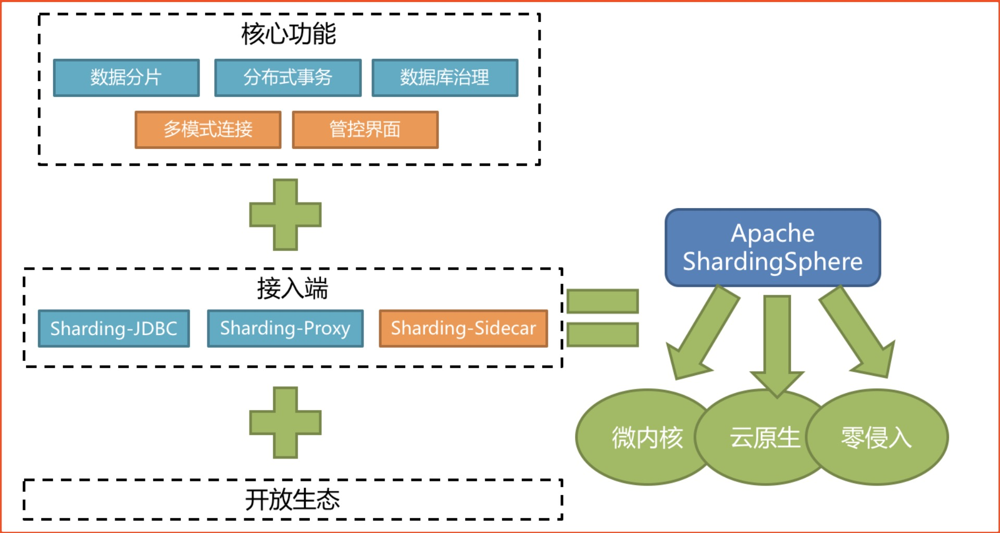
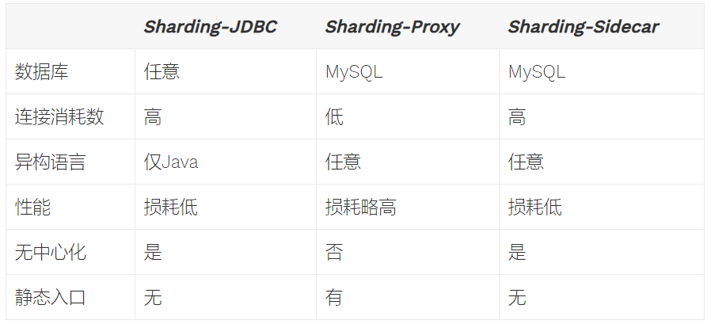
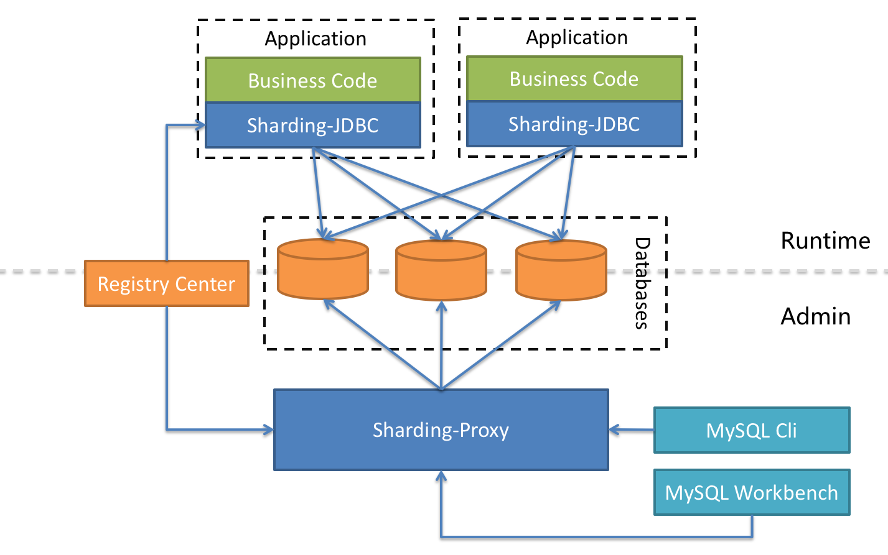

# 01-ShardingSphere简介

### 概念
ShardingSphere是一套开源的分布式数据库中间件解决方案组成的生态圈，它由Sharding-JDBC、Sharding-Proxy 和 Sharding-Sidecar这3款相互独立的产品组成。  
均提供标准化的数据分片、分布式事务 和 数据库治理功能，可适用于如Java同构、异构语言、云原生等各种多样化的应用场景。

### Sharding-JDBC
定位为轻量级Java框架，在Java的JDBC层提供的额外服务。 它使用客户端直连数据库，以jar包形式提供服务，无需额外部署和依赖，可理解为增强版的JDBC驱动，完全兼容JDBC和各种ORM框架。
- 适用于任何基于Java的ORM框架，如：JPA, Hibernate, Mybatis, Spring JDBC Template或直接使用JDBC。
- 基于任何第三方的数据库连接池，如：DBCP, C3P0, BoneCP, Druid, HikariCP等。
- 支持任意实现JDBC规范的数据库。目前支持MySQL，Oracle，SQLServer和PostgreSQL。

### Sharding-Proxy
定位为透明化的数据库代理端，提供封装了数据库二进制协议的服务端版本，用于完成对异构语言的支持。 目前先提供MySQL版本，它可以使用任何兼容MySQL协议的访问客户端(如：MySQL Command Client, MySQL Workbench等)操作数据，对DBA更加友好。
- 向应用程序完全透明，可直接当做MySQL使用。
- 适用于任何兼容MySQL协议的客户端。

### Sharding-Sidecar（TBD）
定位为Kubernetes或Mesos的云原生数据库代理，以DaemonSet的形式代理所有对数据库的访问。 通过无中心、零侵入的方案提供与数据库交互的的啮合层，即Database Mesh，又可称数据网格。    
Database Mesh的关注重点在于如何将分布式的数据访问应用与数据库有机串联起来，它更加关注的是交互，是将杂乱无章的应用与数据库之间的交互有效的梳理。使用Database Mesh，访问数据库的应用和数据库终将形成一个巨大的网格体系，应用和数据库只需在网格体系中对号入座即可，它们都是被啮合层所治理的对象。  

### 混合架构
Sharding-JDBC采用无中心化架构，适用于Java开发的高性能的轻量级OLTP应用；Sharding-Proxy提供静态入口以及异构语言的支持，适用于OLAP应用以及对分片数据库进行管理和运维的场景。

ShardingSphere是多接入端共同组成的生态圈。 通过混合使用Sharding-JDBC和Sharding-Proxy，并采用同一注册中心统一配置分片策略，能够灵活的搭建适用于各种场景的应用系统，架构师可以更加自由的调整适合于当前业务的最佳系统架构。

### 功能列表
#### 数据分片
- 分库 & 分表
- 读写分离
- 分片策略定制化
- 无中心化分布式主键

#### 分布式事务
- 标准化事务接口
- XA强一致事务
- 柔性事务

#### 数据库治理
- 配置动态化
- 编排 & 治理
- 数据脱敏
- 可视化链路追踪
- 弹性伸缩(规划中)

