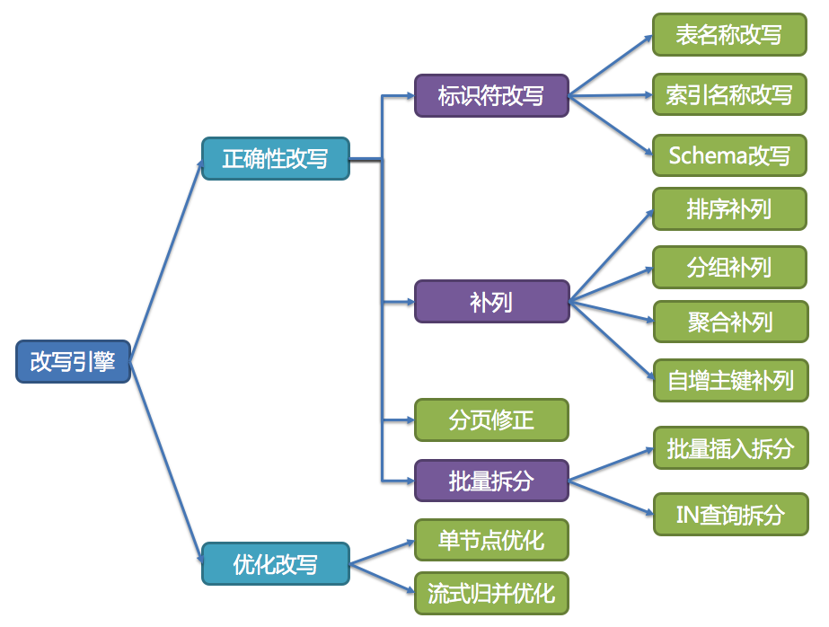

## 数据分片 - 核心概念

ShardingSphere的3个产品的数据分片主要流程是完全一致的。 核心由SQL解析 => 执行器优化 => SQL路由 => SQL改写 => SQL执行 => 结果归并的流程组成。


#### SQL解析
分为词法解析和语法解析。 先通过词法解析器将SQL拆分为一个个不可再分的单词。再使用语法解析器对SQL进行理解，并最终提炼出解析上下文。 解析上下文包括表、选择项、排序项、分组项、聚合函数、分页信息、查询条件以及可能需要修改的占位符的标记。

#### 执行器优化
合并和优化分片条件，如OR等。

#### SQL路由
根据解析上下文匹配用户配置的分片策略，并生成路由路径。目前支持分片路由和广播路由。

#### SQL改写
将SQL改写为在真实数据库中可以正确执行的语句。SQL改写分为正确性改写和优化改写。

#### SQL执行
通过多线程执行器异步执行。

#### 结果归并
将多个执行结果集归并以便于通过统一的JDBC接口输出。结果归并包括流式归并、内存归并和使用装饰者模式的追加归并这几种方式。

### 一、解析引擎
相对于其他编程语言，SQL是比较简单的。 不过，它依然是一门完善的编程语言，因此对SQL的语法进行解析，与解析其他编程语言（如：Java语言、C语言、Go语言等）并无本质区别。

#### 抽象语法树
解析过程分为词法解析和语法解析。 词法解析器用于将SQL拆解为不可再分的原子符号，称为Token。并根据不同数据库方言所提供的字典，将其归类为关键字，表达式，字面量和操作符。 再使用语法解析器将SQL转换为抽象语法树。  
例如，以下SQL：  
```
SELECT id, name FROM t_user WHERE status = 'ACTIVE' AND age > 18
```
解析之后的为抽象语法树见下图。

为了便于理解，抽象语法树中的关键字的Token用绿色表示，变量的Token用红色表示，灰色表示需要进一步拆分。

最后，通过对抽象语法树的遍历去提炼分片所需的上下文，并标记有可能需要改写的位置。 供分片使用的解析上下文包含查询选择项（Select Items）、表信息（Table）、分片条件（Sharding Condition）、自增主键信息（Auto increment Primary Key）、排序信息（Order By）、分组信息（Group By）以及分页信息（Limit、Rownum、Top）。 SQL的一次解析过程是不可逆的，一个个Token的按SQL原本的顺序依次进行解析，性能很高。 考虑到各种数据库SQL方言的异同，在解析模块提供了各类数据库的SQL方言字典。

#### SQL解析引擎
第三代SQL解析器则从3.0.x版本开始，ShardingSphere尝试使用ANTLR作为SQL解析的引擎，并计划根据DDL -> TCL -> DAL –> DCL -> DML –>DQL这个顺序，依次替换原有的解析引擎，目前仍处于替换迭代中。 使用ANTLR的原因是希望ShardingSphere的解析引擎能够更好的对SQL进行兼容。对于复杂的表达式、递归、子查询等语句，虽然ShardingSphere的分片核心并不关注，但是会影响对于SQL理解的友好度。 经过实例测试，ANTLR解析SQL的性能比自研的SQL解析引擎慢3-10倍左右。为了弥补这一差距，ShardingSphere将使用PreparedStatement的SQL解析的语法树放入缓存。 因此建议采用PreparedStatement这种SQL预编译的方式提升性能。

第三代SQL解析引擎的整体结构划分如下图所示。


### 二、路由引擎
根据解析上下文匹配数据库和表的分片策略，并生成路由路径。 对于携带分片键的SQL，根据分片键的不同可以划分为单片路由(分片键的操作符是等号)、多片路由(分片键的操作符是IN)和范围路由(分片键的操作符是BETWEEN)。 不携带分片键的SQL则采用广播路由。

分片策略通常可以采用由数据库内置或由用户方配置。 数据库内置的方案较为简单，内置的分片策略大致可分为尾数取模、哈希、范围、标签、时间等。 由用户方配置的分片策略则更加灵活，可以根据使用方需求定制复合分片策略。 如果配合数据自动迁移来使用，可以做到无需用户关注分片策略，自动由数据库中间层分片和平衡数据即可，进而做到使分布式数据库具有的弹性伸缩的能力。 在ShardingSphere的线路规划中，弹性伸缩将于4.x开启。

#### 分片路由
用于根据分片键进行路由的场景，又细分为直接路由、标准路由和笛卡尔积路由这3种类型。

满足直接路由的条件相对苛刻，它需要通过Hint（使用HintAPI直接指定路由至库表）方式分片，并且是只分库不分表的前提下，则可以避免SQL解析和之后的结果归并。 因此它的兼容性最好，可以执行包括子查询、自定义函数等复杂情况的任意SQL。直接路由还可以用于分片键不在SQL中的场景。

标准路由是ShardingSphere最为推荐使用的分片方式，它的适用范围是不包含关联查询或仅包含绑定表之间关联查询的SQL。 当分片运算符是等于号时，路由结果将落入单库（表），当分片运算符是BETWEEN或IN时，则路由结果不一定落入唯一的库（表），因此一条逻辑SQL最终可能被拆分为多条用于执行的真实SQL。 举例说明，如果按照order_id的奇数和偶数进行数据分片，一个单表查询的SQL如下：
```sql
SELECT * FROM t_order WHERE order_id IN (1, 2);
```
那么路由的结果应为：
```sql
SELECT * FROM t_order_0 WHERE order_id IN (1, 2);
SELECT * FROM t_order_1 WHERE order_id IN (1, 2);
```
绑定表的关联查询与单表查询复杂度和性能相当。举例说明，如果一个包含绑定表的关联查询的SQL如下：
```sql
SELECT * FROM t_order o JOIN t_order_item i ON o.order_id=i.order_id  WHERE order_id IN (1, 2);
```
那么路由的结果应为：
```sql
SELECT * FROM t_order_0 o JOIN t_order_item_0 i ON o.order_id=i.order_id  WHERE order_id IN (1, 2);
SELECT * FROM t_order_1 o JOIN t_order_item_1 i ON o.order_id=i.order_id  WHERE order_id IN (1, 2);
```
可以看到，SQL拆分的数目与单表是一致的。

笛卡尔路由是最复杂的情况，它无法根据绑定表的关系定位分片规则，因此非绑定表之间的关联查询需要拆解为笛卡尔积组合执行。 如果上个示例中的SQL并未配置绑定表关系，那么路由的结果应为：
```sql
SELECT * FROM t_order_0 o JOIN t_order_item_0 i ON o.order_id=i.order_id  WHERE order_id IN (1, 2);
SELECT * FROM t_order_0 o JOIN t_order_item_1 i ON o.order_id=i.order_id  WHERE order_id IN (1, 2);
SELECT * FROM t_order_1 o JOIN t_order_item_0 i ON o.order_id=i.order_id  WHERE order_id IN (1, 2);
SELECT * FROM t_order_1 o JOIN t_order_item_1 i ON o.order_id=i.order_id  WHERE order_id IN (1, 2);
```
笛卡尔路由查询性能较低，需谨慎使用。

#### 广播路由
对于不携带分片键的SQL，则采取广播路由的方式。根据SQL类型又可以划分为全库路由、全库表路由、全实例路由、单播路由和阻断路由这5种类型。

全库路由用于处理对数据库的操作，包括用于库设置的SET类型的数据库管理命令，以及TCL这样的事务控制语句。

全库表路由用于处理对数据库中与其逻辑表相关的所有真实表的操作，主要包括不带分片键的DQL和DML，以及DDL等。

全实例路由用于DCL操作，授权语句针对的是数据库的实例。无论一个实例中包含多少个Schema，每个数据库的实例只执行一次。

单播路由用于获取某一真实表信息的场景，它仅需要从任意库中的任意真实表中获取数据即可。例如：
```sql
DESCRIBE t_order;
```
阻断路由用于屏蔽SQL对数据库的操作，例如：
```sql
USE order_db;
```
因为ShardingSphere采用的是逻辑Schema的方式，无需将切换数据库Schema的命令发送至数据库中。

路由引擎的整体结构划分如下图。


### 三、改写引擎
工程师面向逻辑库与逻辑表书写的SQL，并不能够直接在真实的数据库中执行，SQL改写用于将逻辑SQL改写为在真实数据库中可以正确执行的SQL。 它包括正确性改写和优化改写两部分。

### 3.1、正确性改写
在包含分表的场景中，需要将分表配置中的逻辑表名称改写为路由之后所获取的真实表名称。仅分库则不需要表名称的改写。除此之外，还包括补列和分页信息修正等内容。

#### 1、标识符改写
需要改写的标识符包括表名称、索引名称以及Schema名称。

#### 2、补列
需要在查询语句中补列通常由两种情况导致。 第一种情况是ShardingSphere需要在结果归并时获取相应数据，但该数据并能未通过查询的SQL返回。 这种情况主要是针对GROUP BY和ORDER BY。结果归并时，需要根据GROUP BY和ORDER BY的字段项进行分组和排序，但如果原始SQL的选择项中若并未包含分组项或排序项，则需要对原始SQL进行改写。

#### 3、分页修正
越获取偏移量位置靠后数据，使用LIMIT分页方式的效率就越低。 有很多方法可以避免使用LIMIT进行分页。比如构建行记录数量与行偏移量的二级索引，或使用上次分页数据结尾ID作为下次查询条件的分页方式等。    
分页信息修正时，如果使用占位符的方式书写SQL，则只需要改写参数列表即可，无需改写SQL本身。

#### 4、批量拆分
在使用批量插入的SQL时，如果插入的数据是跨分片的，那么需要对SQL进行改写来防止将多余的数据写入到数据库中。 插入操作与查询操作的不同之处在于，查询语句中即使用了不存在于当前分片的分片键，也不会对数据产生影响；而插入操作则必须将多余的分片键删除。

### 3.2、优化改写
优化改写的目的是在不影响查询正确性的情况下，对性能进行提升的有效手段。它分为单节点优化和流式归并优化。

#### 单节点优化
路由至单节点的SQL，则无需优化改写。 当获得一次查询的路由结果后，如果是路由至唯一的数据节点，则无需涉及到结果归并。因此补列和分页信息等改写都没有必要进行。 尤其是分页信息的改写，无需将数据从第1条开始取，大量的降低了对数据库的压力，并且节省了网络带宽的无谓消耗。

#### 流式归并优化
它仅为包含GROUP BY的SQL增加ORDER BY以及和分组项相同的排序项和排序顺序，用于将内存归并转化为流式归并。 在结果归并的部分中，将对流式归并和内存归并进行详细说明。

改写引擎的整体结构划分如下图所示。


### 四、执行引擎
ShardingSphere采用一套自动化的执行引擎，负责将路由和改写完成之后的真实SQL安全且高效发送到底层数据源执行。 它不是简单地将SQL通过JDBC直接发送至数据源执行；也并非直接将执行请求放入线程池去并发执行。它更关注平衡数据源连接创建以及内存占用所产生的消耗，以及最大限度地合理利用并发等问题。 执行引擎的目标是自动化的平衡资源控制与执行效率。

#### 4.1、连接模式
如果一条SQL在经过ShardingSphere的分片后，需要操作某数据库实例下的200张表。 那么，是选择创建200个连接并行执行，还是选择创建一个连接串行执行呢？效率与资源控制又应该如何抉择呢？

针对上述场景，ShardingSphere提供了一种解决思路。 它提出了连接模式（Connection Mode）的概念，将其划分为内存限制模式（MEMORY_STRICTLY）和连接限制模式（CONNECTION_STRICTLY）这两种类型。

#### 内存限制模式
使用此模式的前提是，ShardingSphere对一次操作所耗费的数据库连接数量不做限制。 如果实际执行的SQL需要对某数据库实例中的200张表做操作，则对每张表创建一个新的数据库连接，并通过多线程的方式并发处理，以达成执行效率最大化。 并且在SQL满足条件情况下，优先选择流式归并，以防止出现内存溢出或避免频繁垃圾回收情况。

#### 连接限制模式
使用此模式的前提是，ShardingSphere严格控制对一次操作所耗费的数据库连接数量。 如果实际执行的SQL需要对某数据库实例中的200张表做操作，那么只会创建唯一的数据库连接，并对其200张表串行处理。  
如果一次操作中的分片散落在不同的数据库，仍然采用多线程处理对不同库的操作，但每个库的每次操作仍然只创建一个唯一的数据库连接。 这样即可以防止对一次请求对数据库连接占用过多所带来的问题。该模式始终选择内存归并。

内存限制模式适用于OLAP操作，可以通过放宽对数据库连接的限制提升系统吞吐量； 连接限制模式适用于OLTP操作，OLTP通常带有分片键，会路由到单一的分片，因此严格控制数据库连接，以保证在线系统数据库资源能够被更多的应用所使用，是明智的选择。

#### 4.2、自动化执行引擎
ShardingSphere最初将使用何种模式的决定权交由用户配置，让开发者依据自己业务的实际场景需求选择使用内存限制模式或连接限制模式。

为了降低用户的使用成本以及连接模式动态化这两个问题，ShardingSphere提炼出自动化执行引擎的思路，在其内部消化了连接模式概念。 用户无需了解所谓的内存限制模式和连接限制模式是什么，而是交由执行引擎根据当前场景自动选择最优的执行方案。

执行引擎分为准备和执行两个阶段。

#### 准备阶段
此阶段用于准备执行的数据。它分为结果集分组和执行单元创建两个步骤。

结果集分组是实现内化连接模式概念的关键。执行引擎根据maxConnectionSizePerQuery配置项，结合当前路由结果，选择恰当的连接模式。 具体步骤如下：
1. 将SQL的路由结果按照数据源的名称进行分组。
2.通过下图的公式，可以获得每个数据库实例在maxConnectionSizePerQuery的允许范围内，每个连接需要执行的SQL路由结果组，并计算出本次请求的最优连接模式。


举例说明，假设一次查询需要在某一数据源上获取两个数据库连接，并路由至同一个数据库的两个分表查询。 则有可能出现查询A已获取到该数据源的1个数据库连接，并等待获取另一个数据库连接；而查询B也已经在该数据源上获取到的一个数据库连接，并同样等待另一个数据库连接的获取。 如果数据库连接池的允许最大连接数是2，那么这2个查询请求将永久的等待下去。下图描绘了死锁的情况。


#### 执行阶段
该阶段用于真正的执行SQL，它分为分组执行和归并结果集生成两个步骤。

分组执行将准备执行阶段生成的执行单元分组下发至底层并发执行引擎，并针对执行过程中的每个关键步骤发送事件。 如：执行开始事件、执行成功事件以及执行失败事件。执行引擎仅关注事件的发送，它并不关心事件的订阅者。 ShardingSphere的其他模块，如：分布式事务、调用链路追踪等，会订阅感兴趣的事件，并进行相应的处理。

ShardingSphere通过在执行准备阶段的获取的连接模式，生成内存归并结果集或流式归并结果集，并将其传递至结果归并引擎，以进行下一步的工作。

执行引擎的整体结构划分如下图所示。


### 五、归并引擎
将从各个数据节点获取的多数据结果集，组合成为一个结果集并正确的返回至请求客户端，称为结果归并。

ShardingSphere支持的结果归并从功能上分为遍历、排序、分组、分页和聚合5种类型，它们是组合而非互斥的关系。 从结构划分，可分为流式归并、内存归并和装饰者归并。流式归并和内存归并是互斥的，装饰者归并可以在流式归并和内存归并之上做进一步的处理。

由于从数据库中返回的结果集是逐条返回的，并不需要将所有的数据一次性加载至内存中，因此，在进行结果归并时，沿用数据库返回结果集的方式进行归并，能够极大减少内存的消耗，是归并方式的优先选择。

流式归并是指每一次从结果集中获取到的数据，都能够通过逐条获取的方式返回正确的单条数据，它与数据库原生的返回结果集的方式最为契合。遍历、排序以及流式分组都属于流式归并的一种。

内存归并则是需要将结果集的所有数据都遍历并存储在内存中，再通过统一的分组、排序以及聚合等计算之后，再将其封装成为逐条访问的数据结果集返回。

装饰者归并是对所有的结果集归并进行统一的功能增强，目前装饰者归并有分页归并和聚合归并这2种类型。

#### 遍历归并
它是最为简单的归并方式。 只需将多个数据结果集合并为一个单向链表即可。在遍历完成链表中当前数据结果集之后，将链表元素后移一位，继续遍历下一个数据结果集即可。

#### 排序归并
由于在 SQL 中存在 ORDER BY 语句，因此每个数据结果集自身是有序的，因此只需要将数据结果集当前游标指向的数据值进行排序即可。 这相当于对多个有序的数组进行排序，归并排序是最适合此场景的排序算法。

对于每个数据结果集中的数据有序，而多数据结果集整体无序的情况下，ShardingSphere 无需将所有的数据都加载至内存即可排序。 它使用的是流式归并的方式，每次 next 仅获取唯一正确的一条数据，极大的节省了内存的消耗。

#### 分组归并
分组归并的情况最为复杂，它分为流式分组归并和内存分组归并。 流式分组归并要求 SQL 的排序项与分组项的字段以及排序类型（ASC 或 DESC）必须保持一致，否则只能通过内存归并才能保证其数据的正确性。

#### 聚合归并
无论是流式分组归并还是内存分组归并，对聚合函数的处理都是一致的。 除了分组的 SQL 之外，不进行分组的 SQL 也可以使用聚合函数。 因此，聚合归并是在之前介绍的归并类的之上追加的归并能力，即装饰者模式。聚合函数可以归类为比较、累加和求平均值这 3 种类型。

#### 分页归并
上文所述的所有归并类型都可能进行分页。 分页也是追加在其他归并类型之上的装饰器，ShardingSphere 通过装饰者模式来增加对数据结果集进行分页的能力。 分页归并负责将无需获取的数据过滤掉。

需要注意的是，由于排序的需要，大量的数据仍然需要传输到 ShardingSphere 的内存空间。 因此，采用 LIMIT 这种方式分页，并非最佳实践。 由于 LIMIT 并不能通过索引查询数据，因此如果可以保证 ID 的连续性，通过 ID 进行分页是比较好的解决方案，例如：
```sql
SELECT * FROM t_order WHERE id > 100000 AND id <= 100010 ORDER BY id;
```
或通过记录上次查询结果的最后一条记录的 ID 进行下一页的查询，例如：
```sql
SELECT * FROM t_order WHERE id > 10000000 LIMIT 10;
```

归并引擎的整体结构划分如下图。


